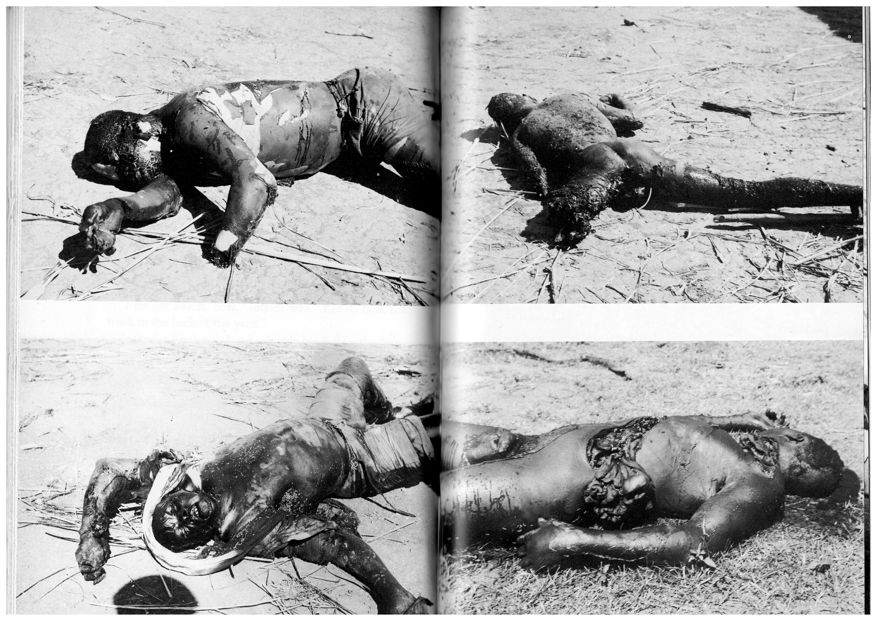
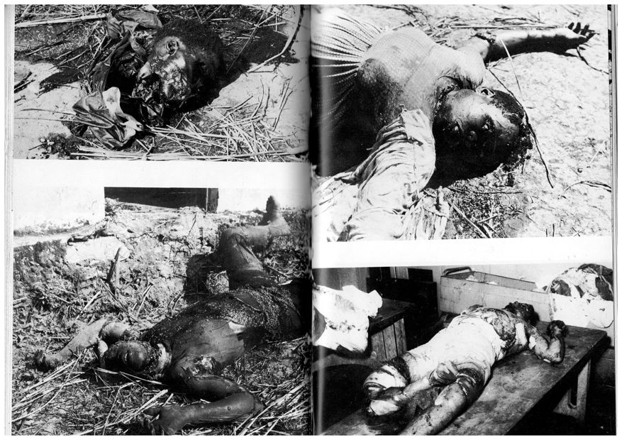
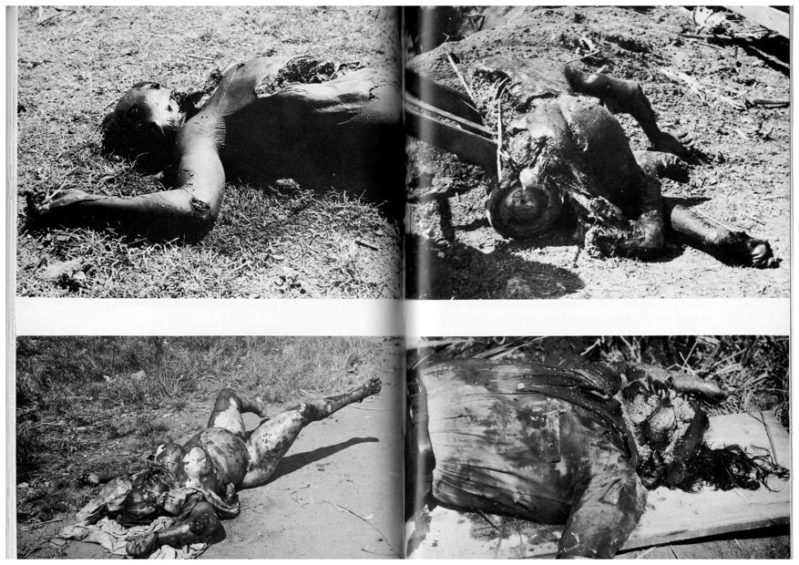
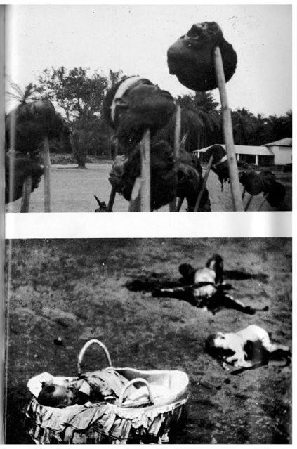

Capítulo nono do livro *The Fabric of Terror*, por Bernardo Teixeira, relatando a visita à plantação *Maria José*, logo 
após os _acontecimentos_ de Março de 1961 e respectivas fotografias.

---
{#cit}

# 9. The Photographs

> ...and the Vision whispers in my dream:  
> I have come from afar in search of your heart  
> to bring it peace and relief, my sleeping friend, 
> but I stare at her in painful surprise 
> (the night is arid as my own infinite) 
> I stare at her with darkened, glassy eyes 
> and I reply: forgive me, benevolent Death, 
> for I have already died and died...  

> ANTHERO DE QUENTAL (1842-1891)
{.align-right}

---

"This is the place," my companion, the photographer from Luanda, said, as he pointed to the burned-up buildings ahead
of us. Our Land Rover proceeded slowly, following the zigzagging path of the military jeep ahead of us, the driver of
which was trying to avoid, by instinct, any land mines buried in the dusty, narrow road. We were coming to a large
commercial plantation, called "Maria José" which is located about thirty kilometers west of Negage, the chief Portuguese
air force base in northern Angola.

Minutes later as we alighted from our vehicles a vast spectacle of desolation and ruin greeted my eyes. All the
buildings — offices, sleeping quarters, dining hall, school, hospital, chapel and warehouses — had been burned to a
crisp, and now, several months after the fire, the Maria José plantation was still abandoned to its fate, surrounded by
a hostile jungle, the tall _capim_ grass and stretching wild weeds taking over the management of the once rich
plantation.

"Two Army photographers and I arrived here on the fourth of June," the photographer explained as we walked slowly
around the burned ghosts of the buildings, "that is, three days after the slaughter. The massacre here took place in the
early hours of June 1, two and a half months after the big killings further north. Not a single white person was at the
plantation on the night the terrorists struck. The few European employees were absent on business."

"What is this?" I asked, as we came to the burned chapel and I saw the small and slightly burned wooden statue of the
Virgin Mary resting on a plumed velvet hat which had been laid on a flat grave of earth.

"A kind of humane touch by one of the terrorists... the only humane touch about this ghastly business," the
photographer explained. "Apparently, one of the terrorists must have been a friend of the fellow buried there, because
he took the trouble to bury him, placing the victim's favorite hat over the grave, and salvaging a Virgin Mary, from the
burning chapel to give added comfort to the dead one. All the other victims were left at the spots where they were
killed and mutilated. The name of the fellow under the earth there was Quiluange Uola, of the Cuale people. He did
treasure his plumed velvet hat and he was also a Catholic, as were more than half of the workers here, judging from the
rosaries and images of saints we found in the debris."

As we turned around to take a look inside of what had been the sleeping quarters for bachelor workers, a band of black
birds flew away in a clatter from a dark corner of the building and an enormous rat, in panic, dashed past the
photographer's legs into the bright sun outside.

"You see that burned beam there?" the photographer asked, pointing to what was left of the ceiling. "A fellow was
hanging from that beam, completely naked. He obviously had been caught by several shots as he tried to escape through
tile high ceiling. The expression of fright on his face, with his teeth buried in the wood of the beam, and his big eyes
practically leaping out of their sockets — that's something I will never forget. His body was hanging from the beam in
the most grotesque fashion. It looked as though it was actually suspended by its genital organs! Imagine, being in that
horrible posture for three days, and dead! I took several pictures of him."

I walked out of the dormitory to catch my breath. Presently I sat down on a rock by the _capim_ grass, contemplating
the scene, and I pulled out of my pocket the "Maria José Memo," copy of which a friend of mine had obtained for me in
Luanda. It was a somewhat ceremonious report addressed to the governor general and written by a conscientious Luanda
bureaucrat who had accompanied the three photographers to the Maria José plantation. It read:[^1]

[^1]: literal translation

> His Excellency, The Governor General of Angola  
> Palace of the Government,  
> Luanda, Angola

{.section}
> Luanda, June 10, 1961

{.section}
> Excellency:

> I have the great honor to bring to Your Excellency's attention the result of the mission with which I was entrusted,
> and which, I earnestly hope, has been carried out in a manner to justify the trust Your Excellency has kindly bestowed
> upon my humble person.

> As a result of Your Excellency's directive, I proceeded on June 2 with three photographers to the town of Negage,
> situated twenty-odd kilometers from the site of the Maria José plantation. Upon our arrival at Negage I solicited from
> the local commandant the support of a military detachment to accompany us to the above mentioned plantation. On the
> strength of Your Excellency's letter of recommendation, the commandant graciously placed at our disposal a small
> motorized escort, under the command of a gallant officer of the Dragoons, Lieutenant of Cavalry J. A. Bruno.

> The dirt road from Negage to the site of the Maria José plantation was most uncomfortable and hazardous, and quite
> dangerous, I may add, due to the tall _capim_ grass and thick forest flanking our way on both sides. With the utmost
> alertness we proceeded on, cautiously, and thus we arrived without incident at a point less than five kilometers from
> the plantation. Here, the first vehicle fell into a trap — a huge hole in the road cleverly covered with canvas and
> dust. Curiously enough, the trap was almost exactly the size of the vehicle which fell into it, thus rendering it
> impossible for the three men inside to escape immediately, as the vehicle in reference had a hard top! We realized
> instantly that we had fallen into an ambush, and this realization was as instantly confirmed by volleys of gunfire from
> the _capim_ on both sides of the road. Perhaps we would not have been able to obtain the photographs, which I have the
> honor to remit to Your Excellency herewith, were it not for the swift and capable reaction of our escort leader,
> Lieutenant Bruno.

> Within a few brief seconds the lieutenant and his soldiers were counterattacking the hidden terrorists, using for
> that purpose the machine gun mounted on one of the jeeps, as well as hand grenades and bazookas. Fortunately, the
> casualties on our side were negligible, due principally to the poor aim of the attackers: a corporal lost two fingers, a
> soldier had his stomach torn off by enemy fire, and another soldier found a bullet in his knee cap. After the barrage of
> machine gun and bazooka fire, and the tossing of hand grenades, our gallant lieutenant, revolver in hand, and his
> soldiers charged upon the hidden enemy position where they found four dead terrorists and a few others who were too
> wounded to be carried away. The remainder of the attackers vanished into the bush, as usual.

> Due to the state of our wounded, we began to retreat toward the village of Dimuca, but before we reached that
> destination, we had to remove the huge trunk of a tree blocking the road. Again we were attacked by the enemy in the
> bush; their numbers appeared to have increased, judging from the amount of fire directed against our vehicles and men.
> Lieutenant Bruno once again reacted swiftly and competently, but we were not making any headway, despite the
> insignificance of our casualties. Happily, at this juncture, fighter planes from the Negage air base appeared overhead
> and began low strafing of the terrorist band. The bandits vanished again. (On our eventual return to Negage we learned
> from the two pilots who came to our rescue that, had we reached the village of Dimuca, we might have come to a sad end,
> for the terrorists and their sympathizers had congregated in that village in a gigantic ambush, waiting for us.)

> After this second attack was frustrated, we turned back toward the Maria José plantation which we finally reached
> without further incidents, although the wounded were feeling most uncomfortable. On our way back to the Maria José we
> rescued the three men still trapped in their vehicle. For that purpose we had to lift half of the vehicle from the hole
> in the ground. The reason why these patient three men were not rescued before was that in the heat of the first battle
> we had forgotten about them and they were, apparently, too polite to shout for help.

{.section}
> Excellency:

> After all these ordeals we finally arrived at the Maria José plantation. The grim spectacle we found is conveyed
> least in part, by the collection of glossy prints submitted herewith.

> According to the investigation carried out by the military patrol, and from the interrogation _in loco_ of the two
> surviving witnesses (two native workers who managed to hide in the grass from whence they were able to see without being
> seen), the plantation was assaulted in the very early hours of the first of June by a large band of terrorists belonging
> to a sect of this region which has connections with terrorist groups operating from the Congo. This sect is known as
> the 'tocoistas.' There were fifty-two workers, some of them with families, at the plantation at the time of the assault.
> Most of them were voluntary workers from the Cuale people, a few from the Negage area, and fewer even were Bailundos
> from the south. Still, a number of them were 'tocoistas,' and these, of course, made common cause with the terrorists,
> helping in the slaughter of their fellow workers.

> According to the testimony of the two witnesses — _a)_ João Continuo, a Bailundo, 20 years of age, native of
> Candande; _b)_ Jurga, of the Cuale people, age undetermined — approximately one hundred terrorists entered the
> plantation unexpectedly before the break of dawn and were promptly joined by about a dozen workers and their families
> who must have been allied to the band. Thereupon the terrorists began the mass killing with great dispatch, using mostly
> the traditionally long and sharp _catanas_, although many of the attackers also had firearms, especially _canhangulos_.
> The operation of the massacre was conducted by a former foreman of the Maria José, known as Corporal Ramos.

> The majority of the victims were asleep when the assault took place. On inspecting the photographs herewith, Your
> Excellency will verify that many of the victims are lying on their beds or else by the side of their beds. Others
> attempted to escape from their rooms or dormitory and were cut down in the act, for their bodies hung from windows or
> lay on the threshold of doors. Some others succeeded in reaching the central patio only to meet the same dreadful fate
> there. Your Excellency will verify, from the enlarged photographs, that most of the victims were slain and mutilated
> with _catanas_, though others were first shot with _canhangulos_, and many others were burned with gasoline (the supply
> of which was abundant at the plantation,) judging from the terrifying appearance of their bodies. In most cases, the
> terrorists dedicated themselves to the gruesome task of cutting up the limbs and heads of the victims. Among the bodies
> we found two women, one of them in a state of pregnancy, as well as a very young boy and two children.

{.section}
> Excellency:

> The spectacle which we saw, and which I have attempted to describe succinctly to Your Excellency, reveals the most
> evil fury and cannibalistic instincts on the part of the contemptible terrorists!

> As I do not wish to burden Your Excellency with too many details of this pitiful tragedy, I shall omit many other
> terrible aspects of my mission. Immediately upon our arrival and inspection, the lieutenant ordered his soldiers to
> prepare a huge burial ditch. The corpses were so decomposed and so replete with vermin, vermin which by now was also
> covering the patio and floors of the buildings, that it became necessary to proceed with a burial en masse at once. (
> After hundreds of photographs were taken of course.) During the burial many of the soldiers became ill with nausea and
> vomited, due principally to the asphyxiating odor, and had to be excused temporarily from their duty. After the sad task
> was completed, it became necessary to cover the grounds with gasoline and set fire to it, in order to destroy the
> vermin, lest public health be effected.

> As Your Excellency will verify from the photographs taken during the mass burial, the tragic scene is reminiscent of
> some of the most horrible scenes prevalent in certain concentration camps during the last world war, but the spirit with
> which we carried out our grim task was a much different one. We regretted our inability to give individual burial to
> each one of the badly decomposed cadavers, but we did place a wooden cross over the mass graveyard, prayers were said by
> the lieutenant and followed by us and, as a finale, a platoon of soldiers in impeccable formation gave a military
> farewell to the victims and fired several volleys into the air.

> After which, Excellency, we proceeded to our vehicles for the dangerous return trip to Negage.

> From the records we were able to find in the office of the plantation, from the testimony of the two eyewitnesses,
> the native workers Continuo and Jurga, and from the reports of the two European employees, Barraqueiro and Calixto, who
> were not at the plantation at the time of the massacre, we presume that, among the forty bodies we buried, there were
> the following thirty-six people:

{.section}
> OF THE BAILUNDO PEOPLE

> Maurício,
> Eugénio Cacala,
> André Pinto,
> Maria Bento,
> José Bento,
> Maria Bumba,
> Manuel Bumba,
> João (a child)

{.section}
> OF THE CUALE PEOPLE

> Bernardo Quiluange,
> José Cabaca,
> Queta Quiluange (a child),
> Cassua Quissanga,
> Quiluange Uola,
> Faustino,
> Ferraz Gonga,
> Manuel Capemba,
> Jacinto Massango,
> Daniel Cabaca,
> Agostinho Bravo,
> Luamba Gunza,
> Armando Zua,
> Joaquim Ebo,
> Fonseca Vunge,
> João Curiba,
> Albino Dala,
> Joaquim Quisanga,
> Tomaz Camuege,
> Neves Gonga,
> Mário Catenda,
> Albino Zua,
> Samuel Lenga,
> Bernardo (a child),
> Ferraz Camuege,

{.section}
> FROM DIMUCA

> Quimbuari Luma (foreman),
> Malau Cambige,
> Mulaza Mahula (foreman),

{.section}
> Excellency:

> It was not possible to obtain even tentative identification of four of the bodies, due to the insufficiency of the
> records and the extremely advanced stage of decomposition of the corpses. Even amongst the names of the victims listed
> above, there is the distinct possibility of an error or two, that is to say that I may have listed as dead two or three
> Cuale workers who may have joined the terrorists, in which case the respective bodies would belong, of course, to two or
> three others whom we listed as having gone with the terrorists. As I had previously pointed out to Your Excellency, on
> the excellent corroboration of the eyewitnesses, Continuo and Jurga, about a dozen workers — not a single one of them
> Bailundo, of course — made common cause with the terrorists.

> Therefore, Your Excellency, the two packages of photographs, labelled A and B, appertain entirely to scenes and
> deceased persons we found at this unfortunate Maria José plantation.

> The third package of photographs, labelled C, refers to another and smaller massacre, yet of exceedingly savage
> proportions, which took place near Camabatela at the plantation owned by the German national, Herr Karl Hucking.

> As the signatory of these lines was not present at that other location when our photographers took the pictures
> herewith, it remains for me to convey to Your Excellency some of the pertinent details which were verified by our
> photographers _in loco_, and which emphasize the particular fiendishness of these crimes, faithfully captured by the
> cameras of our photographers. For example, the pregnant native woman appearing in several of the enclosed glossy prints
> was bearing the child of one of the German nationals on the plantation, specifically, the son of the proprietor,
> according to common knowledge at Camabatela.

> The other three _mestizo_ children of the same woman, also fathered by the same white man, were savagely slain, cut
> up and burned by the crazed terrorists who, not satisfied with so horrible a deed, tossed the pitiful remains of the
> children into the buckets where the hogs were fed, the hogs being the only living things which escaped the massacre at
> the Hucking plantation.

{.section}
> Excellency:

> The lines above are a succinct resume of the tragic events documented by the photographs contained in the three
> packages, labelled A, B and C. The slight delay in forwarding these photographs to Your Excellency's office was due to a
> clerical error for which I am partly responsible, since it occurred in my own office: without carefully examining the
> character of the pictures in question, one of my subaltern clerks shipped them off to the Department of Tourism.
> Presently, the error was discovered and corrected.

> I avail myself of this opportunity to present to Your Excellency the assurances of my highest consideration.

---

[][3]

[3]: images/fotografias_1.jpg

[][4]

[4]: images/fotografias_2.jpg

[][5]

[5]: images/fotografias_3.jpg

[][6]

[6]: images/fotografias_4.jpg

[][7]

[7]: images/fotografias_5.jpg

